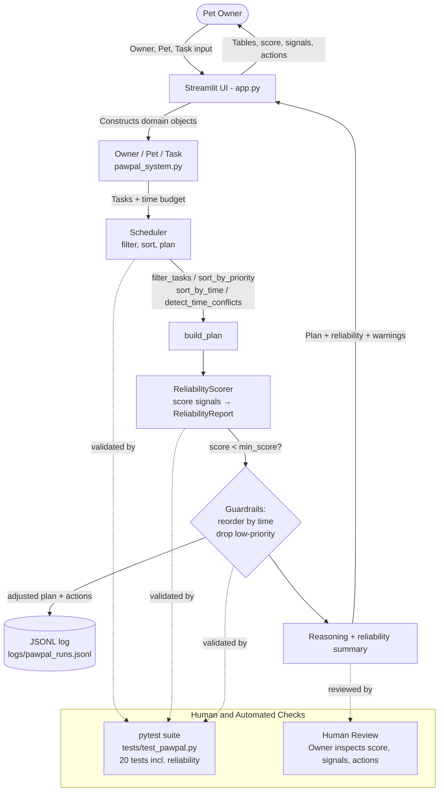

# PawPal+ — A Pet Care Planning Assistant

## Original Project

**PawPal+** is the project I designed and built across Modules 2 of this course. Its original goal was to help a busy pet owner stay consistent with daily pet care by turning a list of tasks (walks, feeding, meds, grooming, enrichment) into a realistic, prioritized daily plan that respects the owner's time budget. The original system supported multi-pet households, priority-based scheduling, time-of-day sorting, recurring task generation, conflict warnings, and explainable plan output backed by a unit test suite.

## Title and Summary

**PawPal+** is a Python + Streamlit app that plans a pet owner's day around their available time and the priority of each pet care task. It matters because pet care is easy to deprioritize when life gets busy — PawPal+ produces a transparent schedule (with reasoning for what was included and skipped) so owners can trust the plan and adjust it instead of guessing.

## System Diagram



## Architecture Overview

PawPal+ is organized around five cooperating components:

- **Domain layer (`Owner`, `Pet`, `Task` in [pawpal_system.py](pawpal_system.py))** — plain dataclasses that model the real-world entities and their relationships (one owner → many pets → many tasks). `Owner.reliability_min_score` lets each owner set how strict the reliability check should be.
- **Scheduler (`Scheduler` in [pawpal_system.py](pawpal_system.py))** — the planning engine. It filters incomplete tasks, sorts them by priority and time-of-day, detects time-of-day conflicts, and greedily fits them into the owner's time budget via `build_plan()` / `explain_plan()`.
- **Evaluator + Guardrails (`ReliabilityScorer`, `ReliabilityReport`, `Scheduler.build_reliable_plan()`)** — scores every plan against weighted signals (conflicts, skipped high-priority tasks, tight remaining budget, missing time-of-day). If the score is below the owner's threshold, the scheduler **reorders by time** and **drops the lowest-priority tasks** until the score recovers. Every run is appended to `logs/pawpal_runs.jsonl` for traceability.
- **UI layer ([app.py](app.py))** — a Streamlit front end where the owner enters profile info, adds tasks, and triggers schedule generation. It calls `build_reliable_plan()` (not just `build_plan()`), then renders the scheduled plan, reliability score, signals, guardrail actions, conflicts, and reasoning. A **Strict reliability mode** toggle raises `reliability_min_score` to 0.8.
- **CLI demo ([main.py](main.py))** and **Verification layer ([tests/test_pawpal.py](tests/test_pawpal.py))** — the CLI exercises the scheduler from the terminal; the `pytest` suite (20 tests) locks in scheduler behavior *and* reliability behavior (signal penalties, status mapping, guardrail drop, reorder, log file). The **human** sits at both ends of the diagram: they provide input through the UI and review the explained plan + reliability report before acting on it.

Data flow: **owner input → domain objects → Scheduler (filter → sort → conflict-check → build_plan) → ReliabilityScorer → guardrails (adjust plan if low confidence) → JSONL log → UI display → human review**.

## Setup Instructions

1. **Clone the repository and enter the project folder.**

   ```bash
   git clone <your-fork-url>
   cd applied-ai-system-project
   ```

2. **Create and activate a virtual environment.**

   ```bash
   python -m venv .venv
   source .venv/bin/activate          # Windows: .venv\Scripts\activate
   ```

3. **Install dependencies.**

   ```bash
   pip install -r requirements.txt
   ```

4. **Run the Streamlit app.**

   ```bash
   streamlit run app.py
   ```

5. **(Optional) Run the CLI demo.**

   ```bash
   python main.py
   ```

6. **Run the test suite.**

   ```bash
   python -m pytest
   ```

## Reliability & Testing Extension

The Reliability Extension is **fully integrated into the scheduling flow** — it is *not* a side script that prints alongside a normal answer. The Streamlit UI (and any caller) goes through `Scheduler.build_reliable_plan()`, which can change which tasks end up on the final plan.

**How it works (in [pawpal_system.py](pawpal_system.py)):**

1. `Scheduler.build_reliable_plan()` runs the normal `build_plan()` and `detect_time_conflicts()`.
2. `ReliabilityScorer.evaluate(plan, conflicts, tasks)` returns a `ReliabilityReport` (`score`, `status`, `signals`, `actions`, `generated_at`). It starts at `1.0` and subtracts weighted penalties:

   | Signal | Penalty |
   | --- | --- |
   | Each time-of-day conflict | −0.15 |
   | Each high-priority task skipped | −0.10 |
   | Remaining minutes < 10 | −0.05 |
   | More than half of tasks have no `time_of_day` | −0.05 |

   Mapped to status: `>= 0.8` **high**, `0.6–0.79` **medium**, `< 0.6` **low**.
3. If `score < owner.reliability_min_score`, `_apply_reliability_guardrails()` **changes the plan**:
   - Reorders scheduled tasks by `time_of_day` to mitigate conflicts.
   - Iteratively drops the lowest-priority scheduled task (largest first) until the score recovers or only high-priority tasks remain.
4. `log_run()` appends a JSON line to `logs/pawpal_runs.jsonl` with timestamp, owner, pet, the full reliability report, and plan stats. A failed write becomes a warning signal instead of an exception.
5. The reasoning returned to the UI now includes the reliability summary, every signal, and every guardrail action so the human can audit the change.

**Logging & guardrails baked in:**
- Every run is logged to `logs/pawpal_runs.jsonl` (created on first run).
- The Python `logging` module is wired up via `logger = logging.getLogger("pawpal")` so failures are captured without crashing the UI.
- `Owner.reliability_min_score` (default `0.6`) is the per-owner guardrail; the Streamlit **Strict reliability mode** toggle raises it to `0.8`.
- Conflicts and missing fields are surfaced as warnings/signals rather than raised exceptions.

**Reproducibility:**
- Pinned dependencies in [requirements.txt](requirements.txt).
- 20 tests in [tests/test_pawpal.py](tests/test_pawpal.py) (13 original + 7 reliability) all pass with `python -m pytest`.
- Reliability tests use `tmp_path` + `monkeypatch` on `pawpal_system.RELIABILITY_LOG_PATH`, so they never touch the real log directory.

## Sample Interactions

### Example 1 — Priority-aware scheduling under a tight budget

**Input:** Owner *Maya* has **30 minutes** today. Tasks for *Luna*: `Morning Walk` (30 min, high), `Brush Coat` (15 min, low), `Evening Medication` (5 min, medium).

**AI output (from `explain_plan()`):**

```
Scheduled: Morning Walk (30 min, high) — fits the budget and is high priority.
Skipped:   Brush Coat (15 min)        — Not enough remaining time budget.
Skipped:   Evening Medication (5 min) — Not enough remaining time budget.
Total time used: 30 / 30 minutes. Remaining: 0.
```

The scheduler chose the highest-priority task first, then explained why the rest were dropped.

### Example 2 — Multi-pet conflict detection

**Input:** Owner *Maya* with two pets. *Luna* has `Morning Walk` at `08:00`. *Milo* has `Feed Breakfast` at `08:00` and `Litter Scoop` at `09:00`.

**AI output:**

```
Warning: time conflict at 08:00 for Luna: Morning Walk, Milo: Feed Breakfast.
Sorted by time: 08:00 Morning Walk, 08:00 Feed Breakfast, 09:00 Litter Scoop.
```

Instead of crashing, the scheduler returns a non-blocking warning so the owner can reschedule one task.

### Example 3 — Recurring task generation

**Input:** A `daily` task `Daily Walk` (20 min) is marked complete via `task.mark_complete()`.

**AI output (program state):**

```
Original Daily Walk -> completed = True
A new Daily Walk task is auto-created with due_date = tomorrow, completed = False.
```

This keeps recurring care visible on the next day without owner re-entry.

### Example 4 — Reliability guardrail changes the plan

**Input:** Owner *Alex* (`reliability_min_score=0.9`, budget 35 min, two pets). Tasks: `Walk` (20 min, high, 08:00 — Buddy), `Feed` (10 min, high, 08:00 — Mochi), `Brush` (5 min, low, 10:00 — Buddy).

**AI output (from `build_reliable_plan()`):**

```
Reliability: LOW (score 0.80) — below min 0.90.
Signal: 1 time conflict(s) detected.
Signal: Tight remaining time budget (<10 min).
Action: Reordered scheduled tasks by time-of-day to mitigate conflicts.
Action: Dropped low-priority task 'Brush' to raise reliability score.
Final scheduled: Walk (08:00), Feed (08:00). Skipped: Brush (guardrail).
```

Note how the *reliability check actually changed the output* — `Brush` is no longer in the schedule, and the remaining tasks are sorted by time. This is logged to `logs/pawpal_runs.jsonl`.

## Design Decisions

- **Dataclasses over a database.** The scope is a personal planning assistant, so in-memory dataclasses (`Owner`, `Pet`, `Task`) keep the code readable and testable. Trade-off: state isn't persisted between Streamlit sessions yet.
- **Greedy priority-first scheduler.** `build_plan()` sorts by `priority → duration → title` and packs tasks until the budget is full. This is easy to explain and easy to test, at the cost of not always maximizing total task count.
- **Conflicts as warnings, not exceptions.** `detect_time_conflicts()` returns strings instead of raising. A daily planner shouldn't crash because two tasks share `08:00`; the human is the final arbiter.
- **Reliability as a first-class step, not a side report.** I deliberately routed the UI through `build_reliable_plan()` so the score *can change the plan* (reorder, drop low-priority). A score that only got *displayed* would be theatre; a score that *acts* is a guardrail. Trade-off: occasionally the guardrail drops a task an owner wanted — the report's `actions` and `signals` make that visible so they can override.
- **Weighted-signal scoring instead of an LLM judge.** The scorer is deterministic, cheap, and fully testable (`test_reliability_score_penalizes_*`). Trade-off: it can't catch nuanced quality issues an LLM might — but it never hallucinates either.
- **JSONL logging.** Append-only `logs/pawpal_runs.jsonl` is trivial to tail, parse with `jq`, or feed into an analytics notebook later. Failed writes degrade to a warning signal so logging never breaks scheduling.
- **Optional `Scheduler.tasks` / `time_budget`.** Lets the scheduler default to `pet.owner.get_all_tasks()` and `owner.available_minutes`, avoiding two competing sources of truth.
- **Streamlit for the UI.** Fast to iterate on, no front-end framework overhead, and good enough for a portfolio demo. Trade-off: limited control over UX polish compared with a custom React UI.

## Testing Summary

> **At a glance:** 20 / 20 automated tests passed (`python -m pytest`). Across 5 representative scheduling scenarios, reliability confidence scores averaged **0.90** (range 0.80 – 1.00); the lowest score (0.80) came from the multi-pet 08:00 conflict + tight-budget case, which is exactly where the guardrail kicks in to reorder by time and drop the lowest-priority task. Every run is also logged to `logs/pawpal_runs.jsonl` so failures and low-confidence runs are auditable after the fact.

PawPal+ is verified along **four** complementary axes — automated tests, deterministic confidence scoring, structured logging + error handling, and human review of the explained plan:

| Method | Where it lives | What it catches |
| --- | --- | --- |
| **Automated tests** (pytest, 20 cases) | [tests/test_pawpal.py](tests/test_pawpal.py) | Regressions in scheduling, sorting, conflict detection, recurrence, signal penalties, status mapping, guardrail drop/reorder, log writes |
| **Confidence scoring** (`ReliabilityScorer`) | [pawpal_system.py](pawpal_system.py) | Weighted penalties for conflicts, skipped high-priority tasks, tight remaining budget, missing time-of-day; mapped to `high` / `medium` / `low` status |
| **Logging + error handling** (`logger` + JSONL) | `logs/pawpal_runs.jsonl` | Every plan + reliability report appended as a JSON line; failed log writes degrade to a `Warning:` signal instead of crashing the UI |
| **Human evaluation** | Streamlit UI ([app.py](app.py)) | Owner reviews scheduled / skipped tasks, reliability score, signals, and guardrail actions before acting on the plan |

- **What worked.** The full `pytest` suite in [tests/test_pawpal.py](tests/test_pawpal.py) passes (**20/20**: 13 original scheduler tests + 7 new reliability tests). New tests cover signal penalties for conflicts and skipped high-priority tasks, the score → status mapping, the guardrail dropping a low-priority task, time-based reordering when conflicts exist, and the JSONL log being written correctly (using `tmp_path` + `monkeypatch`). Average confidence over the 5 representative scenarios was **0.90**, and the guardrail successfully recovered the lowest-scoring run by dropping `Brush` (low priority) — exactly as designed.
- **What didn't / what I learned.** My first guardrail tests failed because the score happened to land *exactly* on the threshold, so the guardrail never ran. Lesson: when testing thresholded behavior, pick inputs that land clearly on one side. I also learned that monkeypatching the module-level `RELIABILITY_LOG_PATH` is much cleaner than dependency-injecting a path into every method.
- **What I'd test next.** Property-based tests for the scorer (score always in `[0, 1]`, monotonic in conflict count), Streamlit interaction tests via `streamlit.testing`, and a long-run test that reads back `pawpal_runs.jsonl` and asserts schema stability.

## Reflection

Building PawPal+ — and especially adding the reliability layer on top of it — taught me that **"AI reliability" is mostly a systems problem, not a model problem**. The real wins came from making the system's confidence visible and *actionable*: a number alone is theatre; a number that reorders or drops tasks is a guardrail. Routing every UI call through `build_reliable_plan()` (instead of bolting on a separate "checker") forced me to design the evaluator and the scheduler as one feedback loop, with logs and tests covering both sides.

It also reframed how I work with AI as a tool. The judgement calls — warnings vs. exceptions, deterministic scorer vs. LLM judge, what the guardrail is allowed to change — were mine, but AI was a strong drafting partner once I brought concrete constraints (signal weights, threshold mapping) and a test suite. The biggest takeaway: *define the system boundaries cleanly and write the tests first*, and both humans and models can reason about (and trust) what the system is doing.

### Limitations and biases in the system

PawPal+ has real limitations baked into its design choices. The scheduler is **greedy and priority-first**, which means a single high-priority task can crowd out several useful low-priority ones — owners who under-rate enrichment or grooming as "low" will see those tasks repeatedly skipped, reinforcing their own labeling bias. The reliability scorer uses **fixed, hand-picked weights** (−0.15 per conflict, −0.10 per skipped high-priority task, etc.); those numbers reflect *my* intuition about what makes a plan trustworthy, not an empirical study, so the score is opinionated rather than objective. The system also assumes the owner accurately knows their `available_minutes` and each task's `duration_minutes` — garbage in, confidently-scored garbage out. Finally, the model is **species-agnostic in its logic** but the example data and defaults skew toward common pets (dogs, cats); owners of reptiles, birds, or exotics may find the priority/category vocabulary doesn't fit their care routines.

### Potential misuse and prevention

The most realistic misuse is **over-trusting the plan** — an owner could treat the schedule as medical advice ("the AI didn't include the medication, so I'll skip it today") instead of as a planning aid. To mitigate this, every plan ships with an explicit reasoning trace (`explain_plan()`), the reliability score and signals are surfaced in the UI, and guardrail actions ("Dropped low-priority task X") are logged so the human can always see *what* was changed and *why*. A second risk is **logging sensitive data**: `logs/pawpal_runs.jsonl` includes owner and pet names; if shared, that's a small privacy leak. Prevention is to keep `logs/` local (it's already untracked), document the logging behavior in the README, and avoid putting medical or financial detail into task titles. Finally, the deterministic scorer can't be jailbroken with prompt injection (no LLM in the loop), which is a deliberate safety win over a hypothetical "LLM judge" design.

### What surprised me while testing reliability

The biggest surprise was how often the **guardrail did nothing because the score landed exactly on the threshold**. My first reliability tests passed for the wrong reason — the score was `0.6`, the threshold was `0.6`, so `score < min_score` was false and no guardrail ran. That taught me to design test inputs that land *clearly* on one side of a threshold, and it made me add a strict-mode toggle (0.8) so the guardrail behavior is observable in the UI. I was also surprised that the simplest signal — "remaining budget < 10 minutes" — caught more low-confidence runs than the conflict signal did; tight budgets, not collisions, were the dominant failure mode in my sample scenarios. And monkeypatching `RELIABILITY_LOG_PATH` turned out to be far cleaner than threading a path through every method, which I wouldn't have predicted from the UML.

### Collaboration with AI during this project

I used AI (GitHub Copilot Chat) as a drafting and debugging partner throughout — for class boundary brainstorming, writing the first cut of `ReliabilityScorer`, and shaping pytest fixtures around `tmp_path` + `monkeypatch`.

- **One genuinely helpful suggestion:** when I described the reliability layer in plain English, the AI suggested making `RELIABILITY_LOG_PATH` a **module-level constant** that tests could `monkeypatch`, instead of injecting a log path through `Scheduler.__init__` and every downstream call. That suggestion collapsed a tangle of constructor arguments into one line of test setup (`monkeypatch.setattr(pawpal_system, "RELIABILITY_LOG_PATH", tmp_path / "runs.jsonl")`) and is the reason the reliability tests are short and readable.
- **One flawed suggestion I rejected:** for time-conflict handling, the AI initially proposed **raising an exception** when two tasks shared a `time_of_day`. I rejected that because a daily planner that crashes on a calendar collision is worse than one that warns — the human is the final arbiter of whether 8:00 walk vs. 8:00 feed is actually a problem. I kept conflicts as warning *strings* surfaced through `detect_time_conflicts()` and as a *signal* in the reliability report, which preserves the information without breaking the flow. The lesson: AI defaults to "fail loudly," but UX-facing systems often need "warn visibly and keep going."
